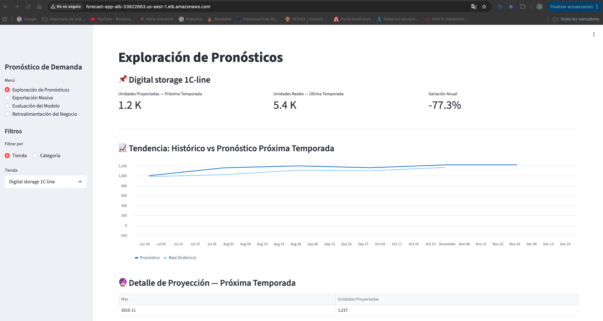
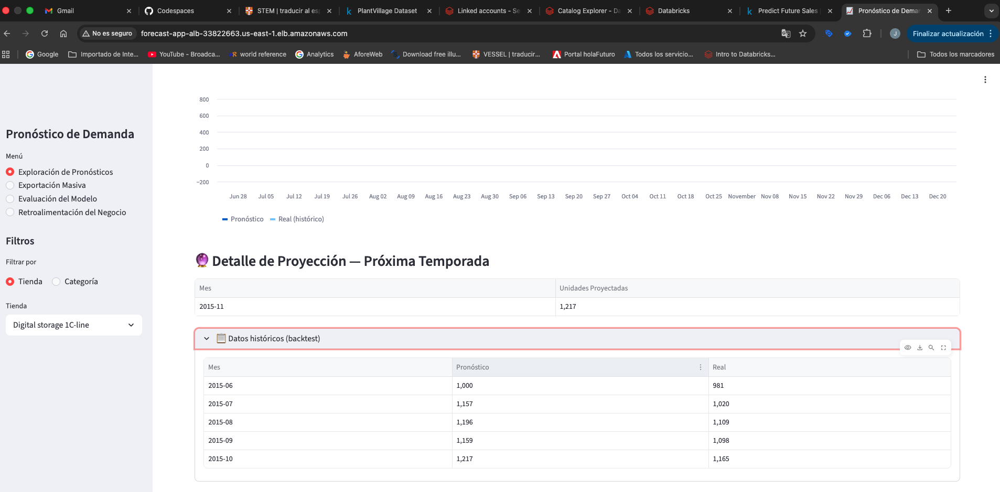
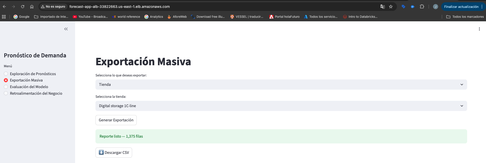
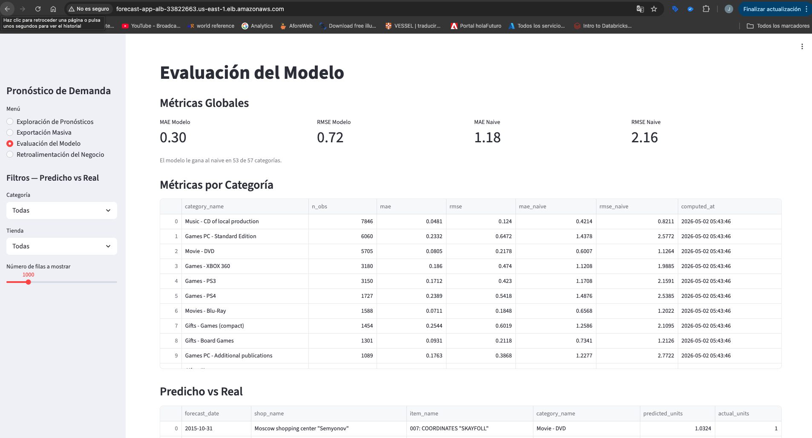
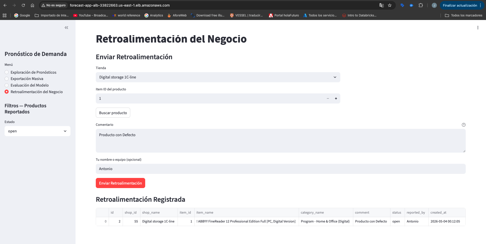
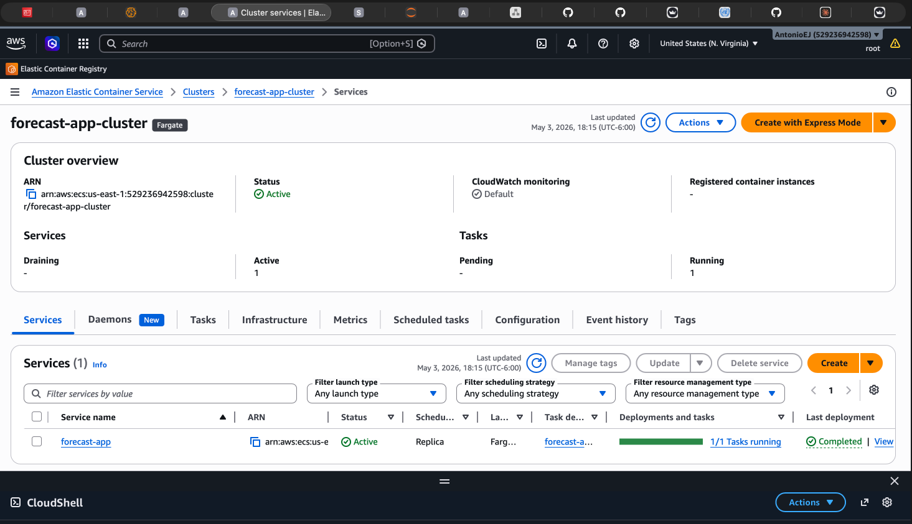
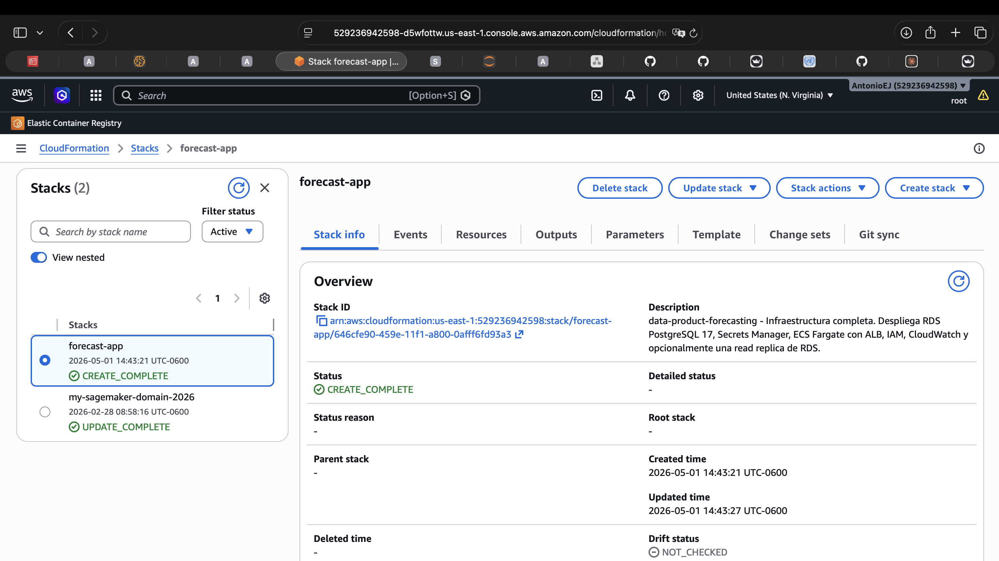
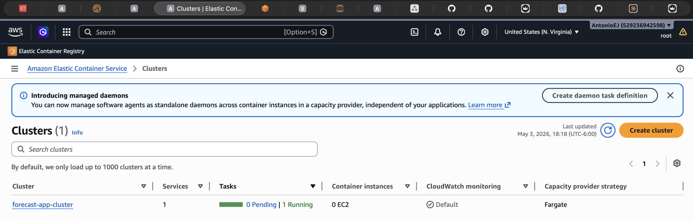
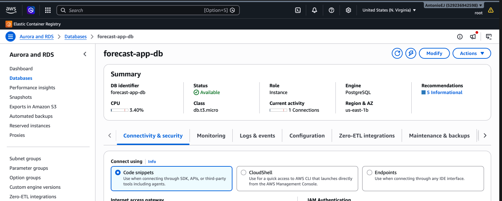
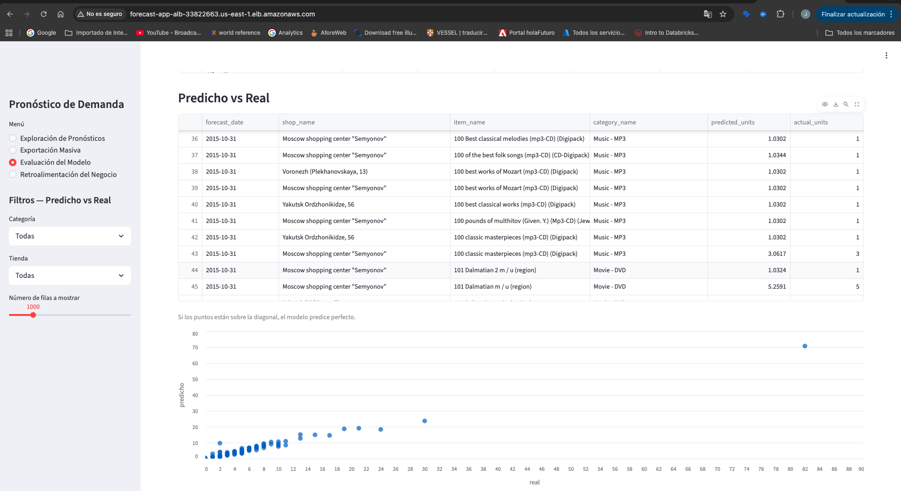

# Forecast Demand — Data Product POC en 1C Company

**Autores:** José Antonio Esparza · Gustavo Pardo  
**Repositorio:** https://github.com/AntonioEJ/data-product-forecasting  
**App en producción:** http://forecast-app-alb-33822663.us-east-1.elb.amazonaws.com


## 1. Resumen Ejecutivo

1C Company opera 60 tiendas con un catálogo de más de 22,000 productos repartidos en 84 categorías. El equipo de planeación toma cada mes la decisión de cuánto comprar de cada producto para cada tienda, y hoy lo hace con intuición y experiencia. Eso funciona, pero deja dinero sobre la mesa: hay sobreinventario en categorías de baja rotación y faltantes en productos que se mueven rápido.

Este proyecto entrega un **producto de datos de pronóstico de demanda** que transforma ~2.9 millones de registros históricos de ventas en toma de decisiones ya que pronostica las ventas mensuales del siguiente período por combinación tienda-producto, y deja al equipo de negocio una interfaz web para explorar los pronósticos, exportarlos y dar feedback cuando alguno no cuadra.

**¿Qué valor genera?**

- Los equipos de Finanzas pueden ver la proyección de la próxima temporada por tienda o categoría en segundos.
- El modelo (LightGBM con features de retraso temporal) baja el error de predicción **74% respecto al baseline naive**: MAE de 0.30 vs 1.18 unidades por predicción.
- Planeación puede exportar un CSV de predicciones filtradas directamente desde el browser, sin depender de un analista.
- En **53 de 57 categorías evaluadas (93%)** el modelo le gana al baseline. Las 4 categorías donde no gana tienen volúmenes marginales entre 1 y 25 observaciones, sin material para aprender.
- El sistema produce **8,675 pronósticos** para noviembre 2015 sobre el catálogo activo, accesibles desde la app vía exploración interactiva o exportación CSV.
- El equipo técnico puede monitorear la calidad del modelo (MAE, RMSE) y compararlo contra un baseline naive, todo desde la misma interfaz.
- La infraestructura completa vive en AWS (PostgreSQL en RDS, Streamlit en ECS Fargate detrás de un ALB) y está versionada en CloudFormation.

**Lo que esto le da a 1C:** decisiones de compra con respaldo cuantitativo, granularidad por tienda y producto, y un canal estructurado para que el equipo de tienda reporte cuando un pronóstico no le cuadra — material directo para el siguiente ciclo de mejora del modelo.

---

## 2. Voz del Cliente

Antes de tocar código nos sentamos a entender quién iba a usar esto. Identificamos siete roles distintos en 1C que tendrían algo que ganar o perder con el producto. Cada uno tiene una pregunta concreta que necesita responder, y la app está diseñada alrededor de esas preguntas:

| Stakeholder | Lo que necesita | Dónde lo resuelve |
|---|---|---|
| VP de Planeación | "¿Cuántas unidades vamos a vender de cada categoría el mes que viene?" | Vista 1: Forecast Exploration |
| Director de Compras | "Necesito el catálogo entero en un Excel para mi análisis." | Vista 2: Batch Export |
| Chief Applied Scientist | "Demuéstrenme que el modelo agrega valor sobre lo que ya hacemos." | Vista 3: Model Evaluation |
| Gerente de Tienda | "Este producto siempre se vende más de lo que dicen ustedes — quiero reportarlo." | Vista 4: Business Feedback |
| Equipo de Datos | "Tengo que poder mantener y extender esto sin volverme loco." | Pipeline modular con tests, Docker, CFN |
| Equipo de TI | "La infra tiene que vivir en nuestra cuenta y poder operarla nosotros." | Stack completo en AWS, IaC |
| Auditoría | "Necesito saber qué predicción se generó cuándo y quién dijo qué del feedback." | Tablas con `created_at`, autor de feedback |

La estructura de cuatro vistas no fue arbitraria. Cada una resuelve un problema concreto de un usuario concreto. La alternativa habría sido hacer una vista monolítica que tratara de servirles a todos a la vez, y eso es justamente lo que produce los dashboards que nadie usa.

---

## 3. Arquitectura del Sistema

### 3.1 Vista de alto nivel

```
┌─────────────────────┐
│ Datos crudos (CSV)  │  Bronze: items.csv, shops.csv,
│ Kaggle Future Sales │  item_categories_en.csv, sales_train.csv
└──────────┬──────────┘
           ↓
┌─────────────────────┐
│ ETL en memoria      │  build_features: lags, rolling means
│ (etl/features.py)   │  make_modeling_dataset, temporal_split
└──────────┬──────────┘
           ↓
┌─────────────────────┐
│ Pipeline ML         │  training/ → modelo LightGBM
│ (offline, local)    │  evaluation/ → métricas por categoría
│                     │  inference/ → backtest + forecasts
└──────────┬──────────┘
           ↓ parquets
┌─────────────────────┐
│ Loaders idempotentes│  db/load_*.py: cargan parquets a RDS
│ (db/)               │  con DELETE+INSERT controlado
└──────────┬──────────┘
           ↓ INSERT
┌─────────────────────┐
│ PostgreSQL en RDS   │  6 tablas: products, shops,
│ (AWS)               │  predictions, metrics, feedback,
│                     │  batch_jobs
└──────────┬──────────┘
           ↑ SELECT/INSERT
┌─────────────────────┐
│ Streamlit App       │  4 vistas conectadas a RDS
│ (ECS Fargate + ALB) │  con cache @st.cache_data(ttl=300)
└─────────────────────┘
```

### 3.2 Las piezas que importan

**Pipeline de modelo (corre offline, en local).** Tres pasos independientes que se ejecutan como módulos de Python:

- `training/` entrena el LightGBM con early stopping. Con 200K filas tarda 25 segundos.
- `evaluation/` calcula métricas globales y por categoría sobre el set de validación temporal.
- `inference/` genera dos artefactos: el backtest (47,324 predicciones con ground truth real) y el forecast (8,675 predicciones para noviembre 2015, sin ground truth porque es el futuro).

**Persistencia (RDS PostgreSQL 17.4).** Seis tablas con foreign keys explícitas. Las predicciones de backtest y de forecast viven en la misma tabla — lo que las distingue es que `actual_units IS NULL` para el forecast y tiene valor para el backtest. Esto evitó duplicar schema y queries.

**Capa de aplicación (Streamlit).** Cuatro vistas independientes que comparten un solo helper de queries (`app/components/db_helpers.py`). Cada query está cacheada por 5 minutos — Streamlit re-ejecuta el script entero en cada click, así que sin cache estaríamos haciendo decenas de queries por minuto.

**Infraestructura (CloudFormation).** Un solo template (`infra/core.yaml`) que despliega VPC, subnets, RDS, ECR, ECS Fargate, ALB y Secrets Manager. Idempotente: se puede correr cuantas veces quieras.

### 3.3 Servicios AWS utilizados

| Servicio | Rol en el sistema | Por qué este servicio |
|---|---|---|
| **S3** | Data lake: almacena raw, bronze, silver y gold | Bajo costo, durabilidad 99.999999999%, integración nativa con Glue y Athena |
| **Glue Data Catalog** | Registro y descubrimiento de datasets en S3 | Permite que Athena y otros servicios encuentren los datos sin configuración manual |
| **Athena** | Construye la capa Gold mediante CTAS | SQL serverless sobre S3 — sin clústeres, sin gestión, pago por query |
| **RDS PostgreSQL 17** | Almacena predicciones, métricas y feedback | Consultas SQL relacionales con baja latencia; soporte a transacciones para feedback |
| **ECS Fargate** | Ejecuta la app Streamlit en contenedor | Serverless: sin gestión de servidores, escalado automático, pago por uso |
| **ECR** | Registro de imágenes Docker | Control de versiones de imágenes, integrado con ECS y IAM |
| **CloudFormation** | Infraestructura como código | Stack completo reproducible: RDS + ECS + ALB + Secrets Manager en un solo comando |
| **Secrets Manager** | Gestión de credenciales de RDS | Las contraseñas nunca están en código ni hardcodeadas en producción |
| **ALB** | Balanceador de carga para la app | Punto de entrada HTTP público con health checks; zero-downtime deploys |
| **CloudWatch** | Logs de la app y del contenedor | Centralización de logs sin infraestructura adicional |

> **Diagrama de arquitectura:** ver [docs/arquitectura.md](docs/arquitectura.md).

---

## 4. Decisiones de Diseño y Trade-offs

### 4.1 Pre-cómputo offline en lugar de inferencia en vivo

**La decisión:** las predicciones se generan offline y se persisten en RDS. Streamlit solo lee.

**Por qué:** un modelo de forecasting mensual no necesita inferencia en tiempo real. Pre-computar evita latencia, simplifica la arquitectura (no hace falta endpoint SageMaker), reduce costos y permite cachear sin remordimiento.

**Lo que sacrificamos:** las predicciones se actualizan solo cuando alguien re-ejecuta el pipeline. Para ciclos mensuales esto está bien.

### 4.2 Una sola tabla de predicciones para backtest y forecast

**La decisión:** backtest y forecast viven en la misma tabla `predictions`, distinguidas por si `actual_units` es NULL o no.

**Por qué:** el modelo de datos es el mismo: `(shop, item, fecha) → predicción`. Separarlas duplicaba schema y queries sin razón. Tuvimos un bug temprano donde los forecasts quedaron como `NaN` literal en lugar de NULL — lo encontramos y arreglamos antes del demo.

### 4.3 SQLAlchemy Core en lugar de ORM

Las queries son agregaciones y joins explícitos, no operaciones sobre objetos. Core es más cercano a SQL puro y sin sorpresas de carga lazy. El ORM agregaba complejidad sin pagarla en valor.

### 4.4 Features en memoria, no en una capa Gold persistida

Los lags y rolling means se calculan en memoria al inicio del training. Lo correcto en producción es persistirlos como capa Gold. No lo hicimos por tiempo — queda como deuda técnica documentada con su solución dimensionada.

### 4.5 Ownership distribuido pero pragmático

Antonio diseñó la infraestructura, los loaders y las vistas 1 y 2. Gustavo construyó el pipeline ML completo y las vistas 3 y 4. El riesgo crítico era el modelo — si LightGBM no le ganaba al naive, no había producto. Concentrar ese riesgo en una persona y dejar a la otra avanzar la infraestructura en paralelo redujo dependencias. Las dos piezas encajaron porque desde el inicio acordamos los contratos de datos: nombres de tablas, columnas, formatos de parquet.

---

## 5. Evaluación del Modelo

### 5.1 Métricas globales

| Métrica | Modelo LightGBM | Baseline Naive (lag_1) | Mejora |
|---|---|---|---|
| MAE | **0.30** | 1.18 | 74% |
| RMSE | **0.72** | 2.16 | 67% |

El modelo se equivoca en promedio 0.30 unidades por predicción vs 1.18 del naive. El MAE bajo pero RMSE relativamente mayor indica que el modelo es muy preciso en la mayoría de SKUs (baja rotación) pero comete errores más grandes en algunos productos de alto volumen — aceptable para el caso de uso de 1C.

### 5.2 Métricas por categoría (top 10 por volumen)

| Categoría | Observaciones | MAE Modelo | MAE Naive | Modelo gana |
|---|---|---|---|---|
| Music - CD of local production | 7,846 | 0.0481 | 0.42 | ✓ |
| Games PC - Standard Edition | 6,060 | 0.2332 | 1.44 | ✓ |
| Movie - DVD | 5,705 | 0.0805 | 0.60 | ✓ |
| Games - XBOX 360 | 3,180 | 0.186 | 1.12 | ✓ |
| Games - PS3 | 3,150 | 0.171 | 1.17 | ✓ |
| Games - PS4 | 1,727 | 0.239 | 1.49 | ✓ |
| Movies - Blu-Ray | 1,588 | 0.071 | 0.66 | ✓ |
| Gifts - Games (compact) | 1,454 | 0.254 | 1.26 | ✓ |
| Gifts - Board Games | 1,301 | 0.093 | 0.73 | ✓ |
| Games PC - Additional publications | 1,089 | 0.176 | 1.23 | ✓ |

### 5.3 ¿Dónde falla el modelo?

El modelo gana al naive en **53 de 57 categorías evaluadas (93%)**. Las 4 donde no gana:

- **"Delivery of goods"** — cargo operativo, no producto físico. No es donde el negocio toma decisiones de compra.
- **"Payment cards - Live!"** — tarjetas prepagadas con comportamiento errático que las features actuales no capturan.
- **Las otras dos** — 1 y 2 observaciones respectivamente. Sin material para aprender.

El patrón es claro: el modelo pierde solo en categorías de naturaleza operativa o estadísticamente irrelevantes. En todo el catálogo real de compras, gana consistentemente.

### 5.4 Fortalezas y limitaciones

El modelo entrena en 25 segundos con 200K observaciones — re-entrenamiento mensual es trivial. Las predicciones están acotadas a no-negativas (clipping a min 0). La validación es temporalmente honesta: split por percentil 80% de fechas.

Limitaciones conocidas: el forecast cubre solo las 8,675 combinaciones tienda-producto con actividad reciente; no usamos features externas (festividades, lanzamientos, precios).

---

## 6. Aplicación Streamlit

**URL de producción:** http://forecast-app-alb-33822663.us-east-1.elb.amazonaws.com

La app tiene cuatro vistas, cada una orientada a un usuario distinto:

| Vista | Usuario objetivo | Qué responde |
|---|---|---|
| Exploración de Pronósticos | VP de Planeación, Gerente de Tienda | ¿Cuánto se va a vender el próximo mes? |
| Exportación Masiva | Director de Compras, Finanzas | Descarga CSV completo sin depender del equipo técnico |
| Evaluación del Modelo | Chief Applied Scientist | ¿El modelo le gana al baseline naive? |
| Retroalimentación del Negocio | Gerente de Tienda | Reportar cuando un pronóstico no cuadra |

### Exploración de Pronósticos

Filtro por tienda o categoría. Muestra el histórico predicho vs real y la proyección de la próxima temporada.


*Filtro por tienda*


*Proyección próxima temporada*

### Exportación Masiva

CSV descargable filtrado por tienda, categoría o catálogo completo. Sin acceso a SQL, sin depender del equipo técnico.



### Evaluación del Modelo

MAE y RMSE globales y por categoría vs baseline naive. Scatter chart predicho vs real con filtros por categoría y tienda.



### Retroalimentación del Negocio

Reporte de problemas por item_id y tienda. Historial filtrable por estado: abierto, revisado, resuelto.



---

## 7. Despliegue

### Stack de infraestructura (`infra/core.yaml`)
- RDS PostgreSQL 17 (db.t3.micro, almacenamiento encriptado)
- ECS Fargate cluster + service + task definition
- ALB con health check en `/_stcore/health`
- Secrets Manager con credenciales de RDS
- IAM roles con mínimo privilegio (secrets scoped por ARN)
- CloudWatch log group

**Build y push de imagen** (desde SageMaker):
```bash
ECR_URI=529236942598.dkr.ecr.us-east-1.amazonaws.com/forecast-app-ecr
aws ecr get-login-password --region us-east-1 | docker login --username AWS --password-stdin $ECR_URI
docker build --network sagemaker -t "${ECR_URI}:latest" .
docker push "${ECR_URI}:latest"
```

**Force re-deploy** (desde CloudShell):
```bash
aws ecs update-service \
    --cluster forecast-app-cluster \
    --service forecast-app \
    --force-new-deployment \
    --region us-east-1
```

En producción (ECS), la app obtiene credenciales de RDS desde Secrets Manager. En local, desde variables de entorno. `data/rds.py` resuelve ambos casos sin configuración adicional.

### Screenshots de AWS

**ECS Fargate — servicio corriendo:**


**CloudFormation — stack en CREATE_COMPLETE:**


**ECR — imagen publicada:**


**RDS — instancia disponible:**


**App pública en el browser:**


---

## 8. Operación

**Logs:** van a CloudWatch Logs bajo `/ecs/forecast-app`, formato estructurado con timestamps y contexto.

**Fallas:** cada vista muestra un error descriptivo si RDS no responde. El ALB tiene health checks cada 30s y reemplaza tareas no saludables automáticamente.

**Disponibilidad:** ECS Fargate mantiene la tarea corriendo y la reemplaza si falla. Rolling deployment garantiza zero-downtime en re-deploys.

---

## 9. Costos estimados (us-east-1)

| Servicio | Estimado mensual |
|---|---|
| RDS db.t3.micro (PostgreSQL) | ~$15 USD |
| ECS Fargate (0.25 vCPU / 0.5 GB, 24/7) | ~$10 USD |
| ALB | ~$18 USD |
| S3, Secrets Manager, CloudWatch | < $3 USD |
| **Total estimado** | **~$46 USD/mes** |

Para POC o desarrollo: apagar RDS e ECS fuera de horario reduce ~70% del costo.

---

## 10. Limitaciones y próximos pasos

### Limitaciones actuales (POC)

- **Datos estáticos**: las predicciones se generaron en batch una sola vez. No hay pipeline programado para actualizar pronósticos automáticamente.
- **Sin autenticación**: la app es pública. Un entorno de producción requiere integración con un Identity Provider (Cognito, Okta).
- **Un solo ambiente**: no hay separación dev/staging/prod. Todo corre en un solo stack de CloudFormation.
- **Modelo no versionado**: LightGBM se entrena una vez. No hay tracking de experimentos ni A/B testing de modelos.
- **Sin alertas operativas**: CloudWatch tiene los logs, pero no hay alarmas configuradas para MAE fuera de umbral o errores de app.

### Para escalar a producción

1. **Orquestar el pipeline** con Apache Airflow o AWS Step Functions para re-entrenar y re-predecir mensualmente.
2. **Versionar modelos** con MLflow o SageMaker Model Registry.
3. **Agregar autenticación** con Amazon Cognito o integración SSO.
4. **Separar ambientes** (dev/prod) con stacks de CloudFormation independientes.
5. **Configurar alarmas** en CloudWatch para degradación del modelo y errores de app.

---

## 11. Uso de Herramientas de IA en el Proyecto

**Herramienta:** GitHub Copilot (Claude Sonnet) — asistente integrado en VS Code.

| Área | Uso específico |
|---|---|
| Consultas técnicas | Dudas sobre SQLAlchemy, psycopg v3, Streamlit, boto3 |
| Revisión de sintaxis | Errores de sintaxis en Python |
| Documentación | Apoyo en redacción de docstrings y README |
| Comandos AWS CLI | Sintaxis de `aws ecs`, `aws ecr`, `aws cloudformation` |
| Debugging | Interpretación de stack traces |

El diseño de la arquitectura, las decisiones de modelado, el schema, el pipeline ETL, la lógica de las vistas, el CloudFormation y los tests son trabajo original del equipo. Las herramientas de IA se usaron como apoyo puntual — equivalente a documentación oficial y/o Stack Overflow u otras fuentes de apoyo.

---

## 12. Conclusiones

El producto funciona y entrega valor concreto: pronósticos accionables con respaldo cuantitativo, una interfaz que cuatro tipos de usuarios pueden usar para sus problemas distintos, y una arquitectura que el equipo de TI de 1C puede operar y extender sin nuestra presencia.

Las decisiones técnicas — pre-cómputo offline, una sola tabla de predicciones, SQLAlchemy Core, features en memoria — fueron pragmáticas y conscientes. Cada sacrificio de elegancia arquitectónica fue por velocidad de entrega del MVP, y cada uno queda documentado como deuda técnica con su solución dimensionada.

El modelo le gana al baseline en el 93% de las categorías, y específicamente en todas donde el negocio toma decisiones reales de compra. Para la siguiente versión el camino es claro: capa Gold persistida, features externas, job programado de re-entrenamiento. Cada uno se mide en días, no semanas. El producto está listo para uso real.

---

## Documentación adicional

- Decisiones de arquitectura: [docs/arquitectura.md](docs/arquitectura.md)
- Modelo de datos (ERD): [docs/erd.md](docs/erd.md)
- Documentación de módulos Python (generada con [pdoc](https://pdoc.dev)): [docs/api/](docs/api/)

---

## Anexo A — Estructura del repositorio

```
data-product-forecasting/
├── etl/                # ETL: bronze, silver, features
├── training/           # Pipeline de entrenamiento
├── evaluation/         # Métricas globales y por categoría
├── inference/          # Generación de predicciones
├── db/                 # Schema y loaders a RDS
├── data/               # rds.py: capa de conexión SQLAlchemy
├── app/                # Streamlit: main, pages, components
├── infra/              # CloudFormation templates
├── artifacts/          # Modelos y predicciones (gitignored)
├── config.py           # Configuración centralizada
├── pyproject.toml      # uv + dependencias
└── Dockerfile          # Imagen para ECS Fargate
```

## Anexo B — Comandos de verificación

```bash
# Verificar conectividad a RDS
uv run python scripts/check_rds.py

# Ejecutar todos los tests
uv run pytest -v

# Levantar la app local (requiere env vars de RDS)
uv run streamlit run app/main.py

# Validar conteos en RDS
uv run python -c "
from sqlalchemy import text
from data.rds import _get_engine
with _get_engine().connect() as c:
    print('Predicciones:', c.execute(text('SELECT COUNT(*) FROM predictions')).scalar())
    print('Metricas:', c.execute(text('SELECT COUNT(*) FROM metrics')).scalar())
    print('Productos:', c.execute(text('SELECT COUNT(*) FROM products')).scalar())
    print('Tiendas:', c.execute(text('SELECT COUNT(*) FROM shops')).scalar())
"
```
