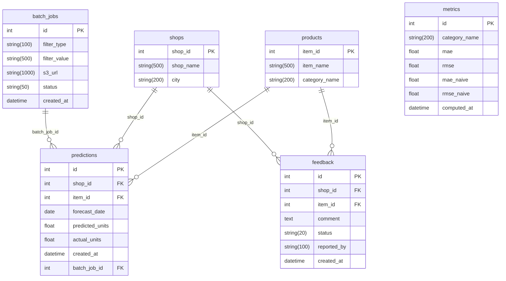

# Esquema Relacional (ERD) — RDS PostgreSQL

## Descripción general

Modelo relacional para el producto de forecasting de demanda. Seis tablas implementadas en `db/schema.py`.

## Diagrama ERD (Mermaid)

## Notas

- `metrics` agrega errores por `category_name`, no por predicción individual. El campo `computed_at` permite rastrear cuándo se calculó cada snapshot de métricas.
- `batch_jobs` registra solicitudes de exportación desde la vista 2. `filter_type` y `filter_value` indican el alcance (categoría, tienda, catálogo completo).
- `actual_units` en `predictions` es nullable: se rellena cuando llega el ground truth.
- `created_at` en `predictions` permite auditoría temporal de cuándo se generó cada pronóstico.
- `batch_job_id` (nullable) liga predicciones al export que las generó, para trazabilidad desde la vista 2.
- `feedback` persiste comentarios de la vista 4 con flujo open/reviewed/resolved (`status`).
- PKs autoincrementales salvo `item_id` y `shop_id`, que se preservan del dataset original de Kaggle.